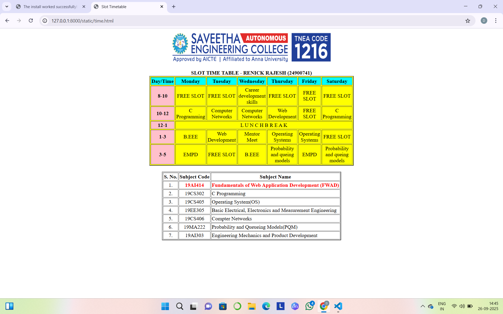

# Ex03 Time Table
## Date:26.09.25

## AIM
To write a html webpage page to display your slot timetable.

## ALGORITHM
### STEP 1
Create a Django-admin Interface.

### STEP 2
Create a static folder and inert HTML code.

### STEP 3
Create a simple table using ```<table>``` tag in html.

### STEP 4
Add header row using ```<th>``` tag.

### STEP 5
Add your timetable using ```<td>``` tag.

### STEP 6
Execute the program using runserver command.

## PROGRAM
```
<html>
<head>
<title>Slot Timetable</title>
</head>
<body>
<center>

</center>
<br>
<table align="center" width="500" cellspacing="3" cellpadding="2" border="2" bgcolor="yellow">
<caption><b>SLOT TIME TABLE - RENICK RAJESH (24900741)</b></caption>
<tr align="center">
<th bgcolor="cyan">Day/Time</th>
<th bgcolor="cyan">Monday</th>
<th bgcolor="cyan">Tuesday</th>
<th bgcolor="cyan">Wednesday</th>
<th bgcolor="cyan">Thursday</th>
<th bgcolor="cyan">Friday</th>
<th bgcolor="cyan">Saturday</th>
</tr>
<tr align="center">
<th bgcolor="pink">8-10</th>
<td>FREE SLOT</td>
<td>FREE SLOT</td>
<td>Career development skills</td>
<td>FREE SLOT</td>
<td>FREE SLOT</td>
<td>FREE SLOT</td>
</tr>
<tr align="center">
<th bgcolor="pink">10-12</th>
<td>C Programming</td>
<td>Computer Networks</td>
<td>Computer Networks</td>
<td>Web Development</td>
<td>FREE SLOT</td>
<td>C Programming</td>
</tr>
<tr>
<th bgcolor="pink">12-1</th>
<td colspan="6" align="center">L U N C H    B R E A K </td>
</tr>
<tr align="center">
<th bgcolor="pink">1-3</th>
<td>B.EEE</td>
<td>Web Development</td>
<td>Mentor Meet</td>
<td>Operating Systems</td>
<td>Operating Systems</td>
<td>FREE SLOT</td>
</tr>
<tr align="center">
<th bgcolor="pink">3-5</th>
<td>EMPD</td>
<td>FREE SLOT</td>
<td>B.EEE</td>
<td>Probability and queing models</td>
<td>EMPD</td>
<td>Probability and queing models</td>
</tr>
</table>
<br>
<table align="center" cellspacing="2" cellpadding="2" border="2">
<tr align="center">
<th>S. No.</th>
<th>Subject Code</th>
<th>Subject Name</th>
</tr>
<tr>
<td align="center">1.</td>
<td align="center"><b><font color = red>19AI414</font></b></td>
<td><b><font color = red>Fundamentals of Web Application Development (FWAD)</font></b></td>
</tr>
<tr>
<td align="center">2.</td>
<td align="center">19CS302</td>
<td>C Programming</td>
</tr>
<tr>
<td align="center">3.</td>
<td align="center">19CS405</td>
<td>Operating System(OS)</td>
</tr>
<tr>
<td align="center">4.</td>
<td align="center">19EE305</td>
<td>Basic Electrical, Electronics and Measurement Engineering</td>
</tr>
<tr>
<td align="center">5.</td>
<td align="center">19CS406</td>
<td>Compter Networks</td>
</tr>
<tr>
<td align="center">6.</td>
<td align="center">19MA222</td>
<td>Probability and Queueing Models(PQM)</td>
</tr>
<tr>
<td align="center">7.</td>
<td align="center">19AI303</td>
<td>Engineering Mechanics and Product Development</td>
</tr>
</table>
</body>
</html>
```
## OUTPUT

## RESULT
The program for creating slot timetable using basic HTML tags is executed successfully.